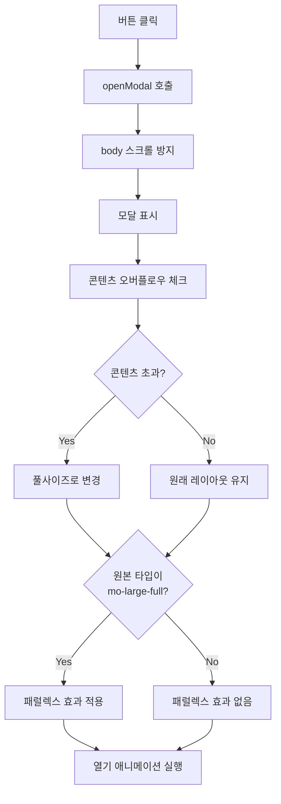
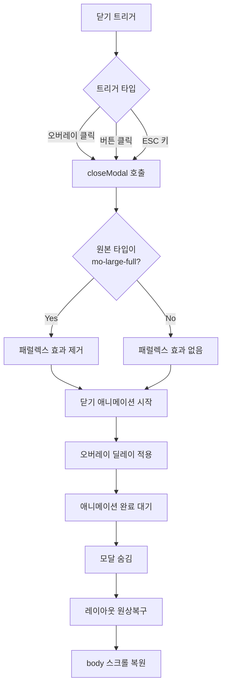

# Motion - 모달 애니메이션 시스템 개발 기획서

## 📋 프로젝트 개요

**Motion**은 다양한 디바이스와 화면 크기에 최적화된 7가지 모달 타입을 제공하는 반응형 모달 애니메이션 시스템입니다. 모바일과 PC 환경에서 각각 다른 UX 패턴을 적용하여 최적의 사용자 경험을 제공합니다.

### 🎯 주요 목표
- **반응형 디자인**: 모바일/PC 환경별 최적화된 모달 레이아웃
- **부드러운 애니메이션**: CSS3와 JavaScript를 결합한 고성능 애니메이션
- **스마트 레이아웃**: 콘텐츠 양에 따른 동적 레이아웃 조정
- **접근성**: 키보드 내비게이션 및 ESC 키 지원

---

## 🏗️ 시스템 아키텍처

### 모달 타입 구조
```
모달 시스템
├── 모바일 모달 (4종)
│   ├── mo-small-center    → 작은 센터 모달
│   ├── mo-small-bottom    → 작은 바텀 시트
│   └── mo-medium-bottom   → 중간 바텀 시트
│   └── mo-large-full      → 전체 화면 모달
└── PC 모달 (3종)  
    ├── pc-small-center    → 작은 센터 모달
    ├── pc-medium-center   → 중간 센터 모달
    └── pc-large-center    → 큰 센터 모달
```

---

## 🚀 모달 동작 시나리오

### 1. 시스템 초기화
**언제**: DOM 로드 완료 시 (`DOMContentLoaded`)
**어떻게**: 

```javascript
// 모든 모달 타입을 사전 생성하여 성능 최적화
Object.keys(modalConfigs).forEach(type => {
    // 템플릿 복제 및 각 타입별 커스터마이징
    const container = document.createElement('div');
    container.id = `modal-container-${type}`;
    // ... DOM 구조 생성
});
```

**결과**: 7가지 모달이 `hidden` 상태로 메모리에 준비됨

### 2. 모달 열기 프로세스

#### 2.1 트리거 이벤트
**언제**: 사용자가 모달 트리거 버튼 클릭
**어떻게**:
```javascript
triggerButtons.forEach(button => {
    button.addEventListener('click', () => openModal(button.dataset.modalType));
});
```

#### 2.2 모달 표시 준비
**무엇을**: Body 스크롤 방지 및 모달 컨테이너 활성화
```javascript
const openModal = (requestedType) => {
    // 1. 스크롤 방지
    document.body.classList.add('overflow-hidden');
    
    // 2. 모달 표시
    modalContainer.classList.remove('hidden');
    
    // 3. 다음 프레임에서 애니메이션 시작
    requestAnimationFrame(() => {
        // 애니메이션 적용...
    });
};
```

#### 2.3 스마트 레이아웃 조정
**언제**: 모바일 모달에서 콘텐츠가 화면을 초과할 때
**어떻게**:
```javascript
const checkAndAdjustModalType = (modalContainer) => {
    const totalContentHeight = modalHeader.offsetHeight + 
                               mainContentElement.scrollHeight + 
                               modalFooter.offsetHeight;
    const availableHeight = modalContainer.clientHeight;
    
    if (totalContentHeight > availableHeight) {
        // 전체 화면 모달로 자동 변경
        modalContainer.dataset.layoutType = 'mo-large-full';
        applyLayoutOnly(modalContainer, 'mo-large-full');
    }
};
```

#### 2.4 애니메이션 실행
**CSS 애니메이션 조합**:
```css
/* 예: 모바일 작은 센터 모달 */
.modal-mo-small-center-open {
    animation: modal-mo-small-center-open 300ms ease-out,
               modal-opacity-open 100ms linear;
}

@keyframes modal-mo-small-center-open {
    from { transform: translateY(50%); }
}
```

### 3. 모달 닫기 프로세스

#### 3.1 닫기 트리거 감지
**다중 닫기 방법 지원**:
```javascript
modalWrapper.addEventListener('click', (e) => {
    // 1. 오버레이 클릭
    if (e.target.classList.contains('modal-overlay')) {
        closeModal(e.target.parentElement);
    }
    
    // 2. 닫기/확인 버튼 클릭
    const button = e.target.closest('.modal-close-btn, .modal-ok-btn');
    if (button) closeModal(modalContainer);
});

// 3. ESC 키 입력
window.addEventListener('keydown', (e) => {
    if (e.key === 'Escape') {
        closeModal(visibleModal);
    }
});
```

#### 3.2 순차적 닫기 애니메이션
**모달 크기별 차등 딜레이**:
```javascript
const OVERLAY_DELAYS = {
    'small': '50ms',    // 작은 모달: 빠른 배경 페이드
    'medium': '150ms',  // 중간 모달: 적당한 딜레이
    'large': '300ms'    // 큰 모달: 긴 딜레이로 자연스러운 효과
};
```

**애니메이션 완료 대기**:
```javascript
const closeModal = (modalContainer) => {
    // 1. 닫기 애니메이션 시작
    modalOverlay.classList.add('animated', 'modal-overlay-close-dynamic');
    modalContent.classList.add('animated', `modal-${type}-close`);
    
    // 2. 애니메이션 지속시간 동적 계산
    const contentDuration = parseDuration(contentComputedStyle.animation);
    const overlayDuration = parseDuration(overlayComputedStyle.animation);
    const timeoutDuration = Math.max(contentDuration, overlayDuration);
    
    // 3. 애니메이션 완료 후 정리
    setTimeout(() => {
        modalContainer.classList.add('hidden');
        // 레이아웃 원상 복구...
    }, timeoutDuration);
};
```

---

## 🎨 애니메이션 상세 스펙

### CSS 변수 시스템
```css
:root {
    /* 타이밍 값 */
    --motion-timing-100: 100ms;
    --motion-timing-300: 300ms;
    --motion-timing-500: 500ms;
    
    /* 이징 함수 */
    --motion-easing-easeOut: cubic-bezier(0.2, 0, 0, 1);
    --motion-easing-easeIn: cubic-bezier(1, 0, 0.8, 1);
    
    /* 배경색 */
    --modal-overlay-default: rgba(0, 0, 0, 0.5);
}
```

### 모달별 애니메이션 패턴

#### 모바일 모달
| 타입 | 열기 애니메이션 | 닫기 애니메이션 | 지속시간 |
|------|----------------|----------------|----------|
| `mo-small-center` | `translateY(50%)` → `translateY(0)` | `translateY(0)` → `translateY(50%)` | 300ms / 200ms |
| `mo-small-bottom` | `translateY(100%)` → `translateY(0)` | `translateY(0)` → `translateY(100%)` | 300ms / 200ms |
| `mo-medium-bottom` | `translateY(100%)` → `translateY(0)` | `translateY(0)` → `translateY(100%)` | 400ms / 300ms |
| `mo-large-full` | `translateX(100%)` → `translateX(0)` | `translateX(0)` → `translateX(100%)` | 500ms / 400ms |

#### PC 모달
| 타입 | 열기 애니메이션 | 닫기 애니메이션 | 지속시간 |
|------|----------------|----------------|----------|
| `pc-small-center` | `translateY(50%)` → `translateY(0)` | `translateY(0)` → `translateY(50%)` | 300ms / 200ms |
| `pc-medium-center` | `translateY(30%)` → `translateY(0)` | `translateY(0)` → `translateY(30%)` | 400ms / 300ms |
| `pc-large-center` | `translateY(15%)` → `translateY(0)` | `translateY(0)` → `translateY(15%)` | 500ms / 400ms |

### 특수 효과

#### 패럴렉스 효과
**언제**: **처음부터** `mo-large-full` 타입으로 설정된 모달에서만 활성화
**중요**: 콘텐츠 오버플로우로 인해 동적으로 풀사이즈로 변경된 경우에는 패럴렉스 효과가 적용되지 않음

**어떻게**:
```css
#main-content.parallax-effect {
    transform: translateX(-20%);
    transition: transform 600ms ease-out;
}
```

**적용 조건**:
```javascript
// 원본 타입(originalType)이 mo-large-full인 경우에만 패럴렉스 적용
const originalType = modalContainer.dataset.originalType;
if (originalType === 'mo-large-full') {
    mainContent.classList.add('parallax-effect');
}
```

**해제 조건**:
```javascript
// 모달 닫을 때 원본 타입이 mo-large-full인 경우에만 패럴렉스 해제
if (modalContainer.dataset.originalType === 'mo-large-full') {
    mainContent.classList.remove('parallax-effect');
}
```

---

## 🔧 핵심 기능 구현

### 1. 동적 콘텐츠 생성
**목적**: 모달 크기별 적절한 콘텐츠 양 제공
```javascript
const getParagraphCount = (type) => {
    const sizeMap = { 'small': 1, 'medium': 2, 'large': 10 };
    const size = Object.keys(sizeMap).find(s => type.includes(s)) || 'small';
    return sizeMap[size];
};

// Lorem Ipsum 문단을 크기별로 동적 생성
loremContent.innerHTML = Array(paragraphCount)
    .fill(baseLoremText)
    .map(text => `<p class="lorem-paragraph">${text}</p>`)
    .join('');
```

### 2. 애니메이션 지속시간 파싱
**목적**: CSS 애니메이션 완료 시점 정확한 감지
```javascript
const parseDuration = (animationStr) => {
    // CSS animation 속성에서 duration + delay 추출
    const timeValues = animationStr.match(/\d+(\.\d+)?(ms|s)/g) || [];
    const timesInMs = timeValues.map(time => {
        const value = parseFloat(time);
        return time.endsWith('s') && !time.endsWith('ms') ? value * 1000 : value;
    });
    
    // 첫 두 값(duration, delay)의 합 반환
    return timesInMs.slice(0, 2).reduce((sum, time) => sum + time, 0);
};
```

### 3. 반응형 리사이즈 핸들링
**목적**: 화면 크기 변경 시 모달 레이아웃 자동 조정
```javascript
const handleResize = () => {
    const visibleModal = modalWrapper.querySelector('.modal-container:not(.hidden)');
    if (visibleModal) {
        checkAndAdjustModalType(visibleModal);
    }
};

// 디바운싱으로 성능 최적화
window.addEventListener('resize', () => {
    clearTimeout(resizeDebounceTimer);
    resizeDebounceTimer = setTimeout(handleResize, 150);
});
```

---

## 🎮 사용자 인터랙션 플로우

### 모달 열기 시퀀스


### 모달 닫기 시퀀스


---

## 📱 반응형 동작 규칙

### 모바일 모달 특화 기능
1. **콘텐츠 오버플로우 감지**
   - 헤더 + 본문 + 푸터 높이가 화면 높이 초과 시
   - 자동으로 `mo-large-full` 레이아웃으로 전환

2. **바텀 시트 패턴**
   - `mo-small-bottom`, `mo-medium-bottom`에서 하단에서 올라오는 애니메이션
   - iOS/Android 네이티브 UX와 일치

3. **전체 화면 모달**
   - `mo-large-full`에서 우측에서 슬라이드 인
   - **처음부터** `mo-large-full` 타입인 경우에만 배경 패럴렉스 효과로 깊이감 연출
   - 동적으로 풀사이즈 변경된 경우는 패럴렉스 효과 없음

### PC 모달 특화 기능
1. **센터 정렬**
   - 모든 PC 모달은 화면 중앙 배치
   - 크기별 다른 Y축 이동 거리로 자연스러운 등장감

2. **크기별 차등화**
   - Small: 50% Y 이동 (빠른 등장)
   - Medium: 30% Y 이동 (적당한 등장)
   - Large: 15% Y 이동 (부드러운 등장)

---

## 🔧 기술적 최적화

### 성능 최적화
1. **GPU 가속 활용**
```css
.modal-body, .modal-overlay {
    will-change: transform, opacity;
    transform: translateZ(0);
    backface-visibility: hidden;
}
```

2. **사전 렌더링**
   - 모든 모달 DOM을 초기화 시점에 생성
   - 런타임 DOM 조작 최소화

3. **디바운싱**
   - 리사이즈 이벤트 150ms 디바운싱
   - 불필요한 레이아웃 재계산 방지

### 메모리 관리
1. **이벤트 위임**
   - 단일 이벤트 리스너로 모든 모달 제어
   - 메모리 누수 방지

2. **애니메이션 상태 정리**
```javascript
// 애니메이션 완료 후 GPU 가속 해제
.modal-container.hidden .modal-body,
.modal-container.hidden .modal-overlay {
    will-change: auto;
}
```

---

## 🎯 확장 가능성

### 추가 모달 타입 정의
새로운 모달 타입 추가 시 필요한 단계:

1. **modalConfigs 객체에 설정 추가**
```javascript
const modalConfigs = {
    // 기존 설정...
    'new-modal-type': { 
        container: 'items-center justify-center p-8', 
        content: 'rounded-xl w-full max-w-sm' 
    }
};
```

2. **CSS 키프레임 애니메이션 정의**
```css
@keyframes modal-new-modal-type-open {
    from { transform: scale(0.8); opacity: 0; }
}

@keyframes modal-new-modal-type-close {
    to { transform: scale(0.8); opacity: 0; }
}
```

3. **애니메이션 클래스 스타일 작성**
```css
.modal-new-modal-type-open {
    animation: modal-new-modal-type-open 400ms ease-out;
}

.modal-new-modal-type-close {
    animation: modal-new-modal-type-close 300ms ease-in forwards;
}
```

---

## 🚨 주의사항 및 제약사항

### 브라우저 호환성
- **최소 요구사항**: ES6+ 지원 브라우저
- **CSS 지원**: `animation`, `transform`, `requestAnimationFrame`
- **권장 브라우저**: Chrome 60+, Firefox 55+, Safari 12+

### 성능 고려사항
1. **대량 콘텐츠 처리**
   - 10개 이상의 문단에서 성능 저하 가능
   - 가상 스크롤링 구현 권장

2. **동시 모달 제한**
   - 현재 구조상 단일 모달만 지원
   - 중첩 모달 필요 시 아키텍처 수정 필요

### 접근성 개선 여지
- **ARIA 라벨링** 미적용
- **포커스 트래핑** 미구현
- **스크린 리더** 최적화 필요

---

## 📖 사용 예시

### 기본 사용법
```html
<!-- 모달 트리거 버튼 -->
<button data-modal-type="pc-medium-center" class="modal-trigger">
    중간 크기 모달 열기
</button>
```

### 프로그래밍 방식 모달 제어
```javascript
// 모달 열기
openModal('mo-small-center');

// 특정 모달 닫기
const modalContainer = document.getElementById('modal-container-pc-large-center');
closeModal(modalContainer);

// 현재 열린 모달 확인
const visibleModal = document.querySelector('.modal-container:not(.hidden)');
```

---

## 🔄 업데이트 로드맵

### v1.1 계획 기능
- [ ] 중첩 모달 지원
- [ ] 커스텀 애니메이션 설정 API
- [ ] 모달 히스토리 관리

### v1.2 계획 기능  
- [ ] 접근성 개선 (ARIA, Focus trap)
- [ ] TypeScript 지원
- [ ] 모달 드래그 앤 드롭

### v2.0 계획 기능
- [ ] 모달 상태 관리 (Redux/Zustand)
- [ ] 서버사이드 렌더링 지원
- [ ] 모바일 제스처 인식

---

*이 문서는 Motion 모달 시스템 v1.0을 기준으로 작성되었습니다.* 